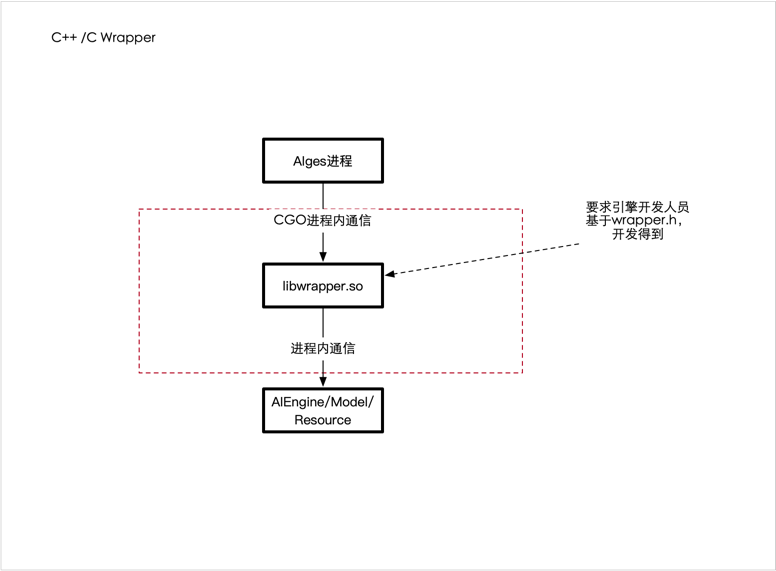
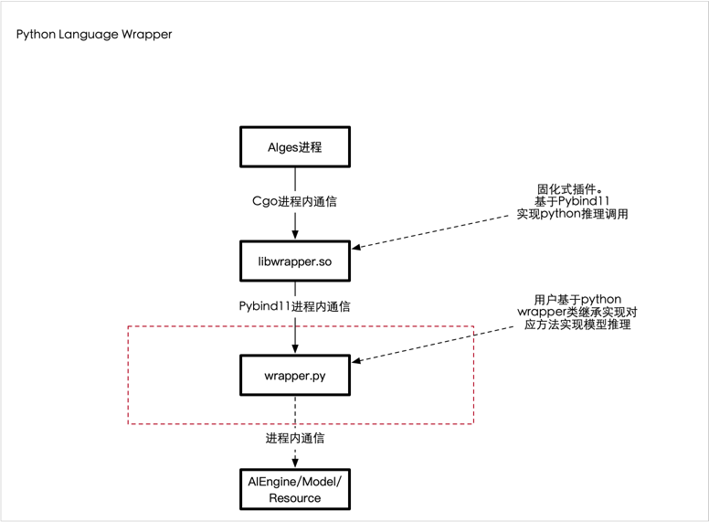

# Aiges 模型即服务插件(Python) v2

<!-- markdownlint-disable MD033 -->

<!-- markdownlint-restore -->

**注意**

本项目为 aiges的配套项目之一，用于支持用户态 Python代码推理服务化。

得益于Aiges的灵活架构， 支持python代码推理快速服务化似乎不再是个难事

## 背景
>引擎托管平台（AI Service Engine）是一个专为AI能力开发者打造的AI算法引擎的无服务全托管式平台，您可以通过集成ASE中提供的插件，快速的部署AI算法引擎，并使用网络、分发策略、数据处理等配套辅助系统。引擎托管平台致力于加速AI算法引擎云服务化，并借助云原生架构，为云服务的稳定提供多重保障，您无需关注底层基础设施及服务化相关的开发、治理和运维，即可高效、安全对引擎进行部署、升级、扩缩、运营和监控。

## 整体架构

其中Loader部分为每一个AI能力对应的抽象，即1个AI能力可对应为一个Loader容器(进程)

Loader插件的架构:

* C/C++ Language Wrapper

* Python Language Wrapper

可以看出两者其实是(o´ω`o)同1个架构，只不过python language 的libwrapper.so 不需要用户实现，用户只需要实现wrapper.py。

而对性能有极高要求，熟练C/C++的用户，可直接实现libwrapper.so 即可被aiges加载。是不是有点俄罗斯套娃的感觉！！

这里我们开源版本aiges将主推 `Python Lanuage Wrapper` 。

事实上 `Python Lanuage Wrapper`  已经演进到[v2版本](https://github.com/xfyun/aiges_c_python_wrapper/tree/master)，

[v1版本](https://github.com/xfyun/aiges_c_python_wrapper/tree/release-v1.0.0) 基于比较裸的Cpython调用，在代码编写以及后期维护上均存在较大问题

而V2的 Pybind11方式在目前市面上大部分 AI 计算框架，如 TensorFlow、Pytorch、阿里 X-Deep Learning、百度 PaddlePaddle 等，均使用 pybind11 来提供 C++到 Python 端接口封装，其稳定性以及性能均已得到广泛验证。

## Project Resources

* Pybind11:  https://github.com/pybind/pybind11/releases
* Aiges: https://github.com/xfyun/aiges

