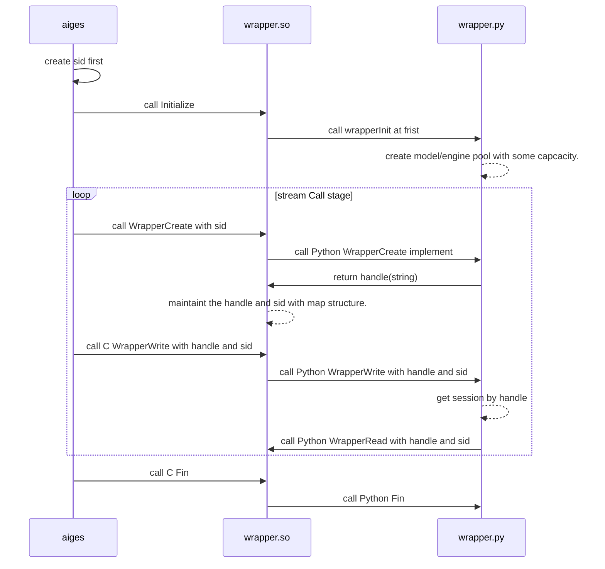

# python加载器流式请求支持设计

## 流程时序图

```mermaid
sequenceDiagram


aiges ->> aiges: create sid first 
aiges ->> wrapper.so: call Initialize
wrapper.so ->> wrapper.py: call wrapperInit at frist
wrapper.py -->> wrapper.py: create model/engine pool with some capcacity.
loop stream Call stage
aiges ->> wrapper.so: call WrapperCreate with sid
wrapper.so ->>  wrapper.py: call Python WrapperCreate implement
wrapper.py ->> wrapper.so: return handle(string)
wrapper.so -->> wrapper.so: maintaint the handle and sid with map structure.
aiges ->> wrapper.so: call C WrapperWrite with handle and sid
wrapper.so ->> wrapper.py: call Python WrapperWrite with handle and sid
wrapper.py -->> wrapper.py: get session by handle
wrapper.py ->> wrapper.so: call Python WrapperRead with handle and sid
end
aiges ->> wrapper.so: call C Fin
wrapper.so ->> wrapper.py: call Python Fin 
```

